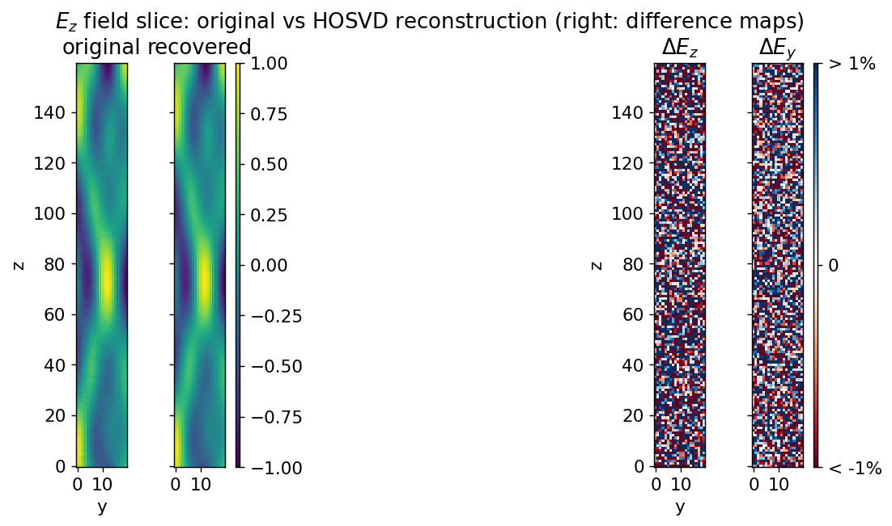
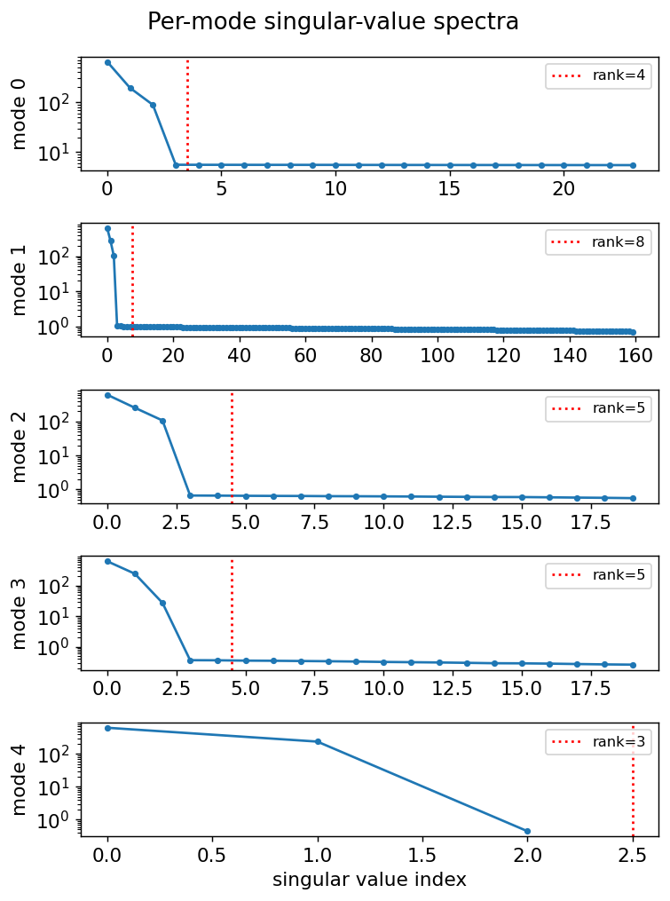
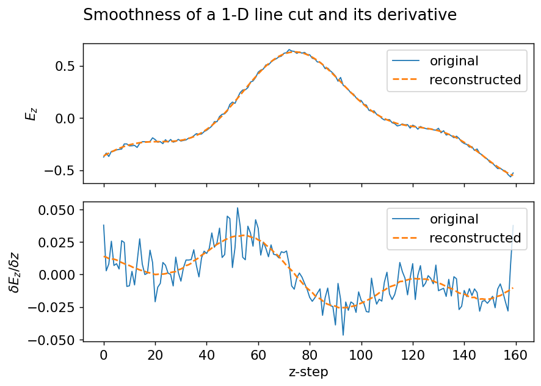

# Field-map HOSVD

**Memory-efficient Higher-Order Singular Value Decomposition (HOSVD) for compressing and denoising multi-dimensional field-map data.**

用高阶奇异值分解 (HOSVD) 对多维场图数据做**压缩**与**去噪**的 Python 工具。

[](https://github.com/duxngsi/Field-map-HOSVD/actions/workflows/ci.yml)


[](https://doi.org/10.1103/PhysRevAccelBeams.21.084601)

> 📄 **This is the implementation behind the paper**
> [X. Du and L. Groening, *"Compression and noise reduction of field maps,"* **Phys. Rev. Accel. Beams 21, 084601 (2018)**](https://doi.org/10.1103/PhysRevAccelBeams.21.084601).
> There, HOSVD compressed the RF electric field map of an 11 m drift-tube linac (DTL)
> cavity from **220 MB to ~20 KB** while reducing noise by **~95%**. See [Citation](#citation--引用).

---

A 5-D electromagnetic field map (e.g. `(x, z, y, parameter, component)`) is large but
highly redundant — the field is smooth, so it has a small **multilinear rank**.
Truncated HOSVD exploits this to store the field in a tiny core tensor plus a few
orthonormal factor matrices, giving **thousands of times compression** while
**removing measurement noise** at the same time.

> On the bundled synthetic 5-D demo (a 4.6 M-value field): **1159× compression**, and a
> field corrupted with 4% noise is recovered to **0.12% error** — the truncation throws
> the noise away along with the redundancy.

一个 5 维电磁场图体积庞大但高度冗余（场是光滑的，多重秩很低）。截断 HOSVD 把场
存成一个很小的核张量加几个正交因子矩阵，在压缩上千倍的同时去除测量噪声。本仓库是
论文 PRAB 21, 084601 (2018) 的开源实现。

---

## Table of contents · 目录

- [Why HOSVD](#why-hosvd--为什么用-hosvd)
- [Install](#install--安装)
- [Quickstart](#quickstart--快速上手)
- [Choosing ranks automatically](#choosing-ranks-automatically--自动选秩)
- [Demo & results](#demo--results--示例与结果)
- [API](#api--接口)
- [How it works](#how-it-works--原理)
- [Project layout](#project-layout--目录结构)
- [Testing](#testing--测试)
- [Migrating from the original API](#migrating-from-the-original-api--从旧接口迁移)
- [Citation](#citation--引用)
- [References](#references--参考)
- [License](#license--许可证)

---

## Why HOSVD · 为什么用 HOSVD

HOSVD is the orthogonal **Tucker decomposition** of a tensor: every mode (axis) is
projected onto the leading singular vectors of its unfolding. For an order-*N* tensor
`X` of shape `(I₁, …, I_N)` truncated to ranks `(R₁, …, R_N)`:

```
X  ≈  G  ×₁ U⁽¹⁾  ×₂ U⁽²⁾  …  ×_N U⁽ᴺ⁾
```

where `G` (the **core**) has shape `(R₁, …, R_N)` and each factor `U⁽ⁿ⁾` has
orthonormal columns. Storage drops from `∏ Iₙ` to `∏ Rₙ + Σ Iₙ·Rₙ`.

This implementation uses **sequentially truncated HOSVD (ST-HOSVD)** and, by default,
extracts each factor from the small `Iₙ × Iₙ` **Gram matrix** `X₍ₙ₎ X₍ₙ₎ᵀ` instead of
SVD-ing the huge unfolding directly — the key trick that makes large field maps
tractable.

本实现采用顺序截断 ST-HOSVD，默认通过 mode-n 的 Gram 矩阵 `X₍ₙ₎X₍ₙ₎ᵀ` 求主奇异
向量，从而避免对超大展开矩阵直接做 SVD。

---

## Install · 安装

```bash
git clone https://github.com/duxngsi/Field-map-HOSVD.git
cd Field-map-HOSVD

# minimal (library only)
pip install numpy

# or install the package with extras for the demo and tests
pip install -e ".[demo,dev]"
```

Only **NumPy** is required for the core library. `matplotlib` is needed for the demo
plots and `pytest` for the test suite.

---

## Quickstart · 快速上手

```python
import numpy as np
from hosvd import HOSVDCompressor, make_synthetic_field

field = make_synthetic_field()                       # smooth 5-D field, shape (20, 60, 15, 15, 3)

model = HOSVDCompressor(ranks=(3, 8, 4, 4, 3)).fit(field)
recovered = model.reconstruct()

print(f"compression ratio  : {model.compression_ratio:.1f}x")
print(f"reconstruction err : {model.reconstruction_error(field) * 100:.2f}%")

# the compressed representation = core tensor + factor matrices
core, factors = model.core, model.factors
```

Functional one-liner:

```python
from hosvd import hosvd
core, factors = hosvd(field, ranks=(3, 8, 4, 4, 3))
```

---

## Choosing ranks automatically · 自动选秩

You don't have to guess the per-mode ranks. Two adaptive criteria pick them from the
data — pass exactly one:

```python
# 1) keep a fraction of the energy in every mode (cuts at the signal/noise elbow)
model = HOSVDCompressor(energy_threshold=0.99).fit(field)

# 2) hit a target overall relative error (error is *guaranteed* not to exceed it)
model = HOSVDCompressor(rel_error=0.05).fit(field)

print(model.effective_ranks)        # the ranks that were chosen
```

Or inspect the suggested ranks without keeping the compression:

```python
from hosvd import select_ranks
select_ranks(field, energy_threshold=0.99)   # -> e.g. [4, 4, 4, 3, 3]
```

The `rel_error` selector uses the error-bounded ST-HOSVD strategy
(Vannieuwenhoven et al., 2012): it spreads the squared-error budget across the modes,
so the reconstruction is provably within the requested tolerance. On the noisy demo
field, `energy_threshold=0.99` automatically finds the rank-4 signal and reaches
**3000×+** compression.

`energy_threshold`（按每维累计能量比例选秩，恰好切在信号/噪声拐点）与 `rel_error`
（按目标总体相对误差选秩，并保证不超过该误差）二选一，无需手动指定每维秩。

---

## Demo & results · 示例与结果

```bash
# run the full compress → reconstruct → plot pipeline
# (auto-generates a synthetic field if Field_5D.npy is absent)
python examples/field_map_demo.py --shape 24 160 20 20 3 --ranks 4 8 5 5 3 --noise 0.04

# ...or let the rank be chosen automatically
python examples/field_map_demo.py --energy 0.99       # add --no-show to only save PNGs
```

Example report on a 4.6 M-value synthetic field map (the figures below):

```
original shape     : (24, 160, 20, 20, 3)  (4,608,000 values)
kept ranks         : (4, 8, 5, 5, 3)
stored values      : 3,976
compression ratio  : 1159.0 x
reconstruction err : 3.99 %  (vs noisy input)
denoising err      : 0.12 %  (vs clean signal)   <- noise removed
SNR (vs input)     : 28.0 dB
```

**Original vs HOSVD reconstruction** — the two field slices are visually identical;
the difference maps (right) contain only the discarded noise:



**Per-mode singular-value spectra** — energy collapses after a handful of components,
which is exactly why the field compresses so well (red lines = kept rank):



**Smoothness** — a 1-D line cut and its derivative stay smooth after reconstruction,
confirming the field's physical structure is preserved:



---

## API · 接口

### `HOSVDCompressor(ranks=None, *, energy_threshold=None, rel_error=None, method="gram", sequential=True)`

Give **at most one** of `ranks`, `energy_threshold`, `rel_error` (otherwise full rank).

| argument           | meaning |
|--------------------|---------|
| `ranks`            | explicit kept rank per mode. `None` → full rank (lossless); `int` → same for all modes; sequence → one per mode (clipped to each mode's size). |
| `energy_threshold` | auto: per mode, keep the fewest leading components whose cumulative energy reaches this fraction in `(0, 1]` (e.g. `0.999`). |
| `rel_error`        | auto: choose ranks so the overall relative Frobenius error is guaranteed `≤` this value (e.g. `0.01`). |
| `method`           | `"gram"` (default, fast/memory-light) or `"svd"` (robust for near-degenerate spectra). |
| `sequential`       | `True` → ST-HOSVD (each factor from the partially compressed tensor); `False` → classic HOSVD. |

| method / property            | returns |
|------------------------------|---------|
| `.fit(tensor)`               | compute core + factors, returns `self` |
| `.reconstruct()`             | reconstruct the (approximate) tensor |
| `.fit_reconstruct(tensor)`   | `fit` then `reconstruct` |
| `.compression_ratio`         | original elements / stored elements |
| `.reconstruction_error(x)`   | relative Frobenius error vs `x` |
| `.core`, `.factors`          | compressed core tensor and factor matrices |
| `.singular_values`           | per-mode singular spectra (for choosing ranks) |

### Helper modules

- `hosvd.hosvd(tensor, ranks, …)` — functional API returning `(core, factors)`.
- `hosvd.select_ranks(tensor, energy_threshold=…, rel_error=…)` — the ranks an adaptive criterion would pick.
- `hosvd.metrics` — `relative_error`, `rmse`, `snr_db`, `psnr_db`, `compression_ratio`.
- `hosvd.datasets` — `make_synthetic_field`, `add_noise` for reproducible test data.
- Low-level tensor algebra: `mode_unfold`, `mode_fold`, `mode_n_product`.

---

## How it works · 原理

For each mode `n`:

1. **Unfold** the (partially compressed) tensor along mode `n` into a matrix `X₍ₙ₎`.
2. Form the small Gram matrix `G = X₍ₙ₎ X₍ₙ₎ᵀ` (size `Iₙ × Iₙ`) and take its leading
   `Rₙ` eigenvectors → factor `U⁽ⁿ⁾` (the left singular vectors of `X₍ₙ₎`).
3. **Project** the tensor onto that basis (`×ₙ U⁽ⁿ⁾ᵀ`), shrinking mode `n` to `Rₙ`.

After all modes, the shrunken tensor is the **core** `G`. Reconstruction undoes the
projections (`×ₙ U⁽ⁿ⁾`). Because the factors are orthonormal, keeping the *largest*
singular directions keeps the most signal energy and discards the rest — which for
smooth fields is mostly noise.

> The Gram route is mathematically equivalent to taking the SVD of the unfolding
> (`G`'s eigenvectors **are** the unfolding's left singular vectors), but only ever
> forms an `Iₙ × Iₙ` matrix — cheap even when the unfolding has millions of columns.

---

## Project layout · 目录结构

```
Field-map-HOSVD/
├── hosvd/                       # the library
│   ├── core.py                 # HOSVDCompressor, auto-rank, tensor algebra, legacy wrapper
│   ├── metrics.py              # error / SNR / compression-ratio metrics
│   └── datasets.py             # reproducible synthetic field generator
├── examples/
│   ├── make_synthetic_field.py # write a synthetic Field_5D.npy
│   └── field_map_demo.py       # compress → reconstruct → plot
├── tests/                      # pytest suite (53 tests)
├── docs/images/                # figures used in this README
├── .github/workflows/ci.yml    # GitHub Actions: pytest on every push
├── CITATION.cff                # machine-readable citation
├── pyproject.toml              # packaging + tooling config
├── requirements.txt
└── LICENSE                     # MIT
```

---

## Testing · 测试

```bash
pip install -e ".[dev]"
pytest
```

The suite checks tensor-algebra round-trips, exact full-rank reconstruction,
monotonic error vs rank, `gram`/`svd` agreement, denoising, factor orthonormality,
rank clipping, and backward compatibility.

---

## Migrating from the original API · 从旧接口迁移

The original `DataSVDCompress` class still works (now backed by `HOSVDCompressor`):

```python
from hosvd import DataSVDCompress       # was: from HOSVD import DataSVDCompress

d = DataSVDCompress(field, keeps=(3, 8, 4, 4, 3))
d.compress_ndm()
d.recover()
d.recovered_data, d.compressed_data, d.v, d.s   # same attributes as before
```

New code should prefer `HOSVDCompressor`, which adds metrics, the `svd` method,
the classic-vs-sequential switch, and input validation.

旧的 `DataSVDCompress` 仍可用（导入路径改为 `from hosvd import DataSVDCompress`），
属性与方法保持兼容；新代码建议直接使用 `HOSVDCompressor`。

---

## Citation · 引用

If this code is useful in your work, please cite the paper it implements
(a [`CITATION.cff`](CITATION.cff) is included, so GitHub shows a *"Cite this
repository"* button):

> X. Du and L. Groening, **"Compression and noise reduction of field maps,"**
> *Physical Review Accelerators and Beams* **21**, 084601 (2018).
> [doi:10.1103/PhysRevAccelBeams.21.084601](https://doi.org/10.1103/PhysRevAccelBeams.21.084601)

```bibtex
@article{du2018compression,
  title     = {Compression and noise reduction of field maps},
  author    = {Du, X. and Groening, L.},
  journal   = {Physical Review Accelerators and Beams},
  volume    = {21},
  number    = {8},
  pages     = {084601},
  year      = {2018},
  month     = aug,
  publisher = {American Physical Society},
  doi       = {10.1103/PhysRevAccelBeams.21.084601},
  url       = {https://doi.org/10.1103/PhysRevAccelBeams.21.084601}
}
```

---

## References · 参考

- X. Du and L. Groening, *Compression and noise reduction of field maps*,
  Phys. Rev. Accel. Beams **21**, 084601 (2018). — **the paper this code implements**.
- L. De Lathauwer, B. De Moor, J. Vandewalle, *A Multilinear Singular Value
  Decomposition*, SIAM J. Matrix Anal. Appl., 21(4), 2000.
- N. Vannieuwenhoven, R. Vandebril, K. Meerbergen, *A new truncation strategy for the
  higher-order singular value decomposition*, SIAM J. Sci. Comput., 34(2), 2012.
- T. G. Kolda, B. W. Bader, *Tensor Decompositions and Applications*, SIAM Review,
  51(3), 2009.

---

## License · 许可证

[MIT](LICENSE) © 2018–2026 Xiaonan Du
